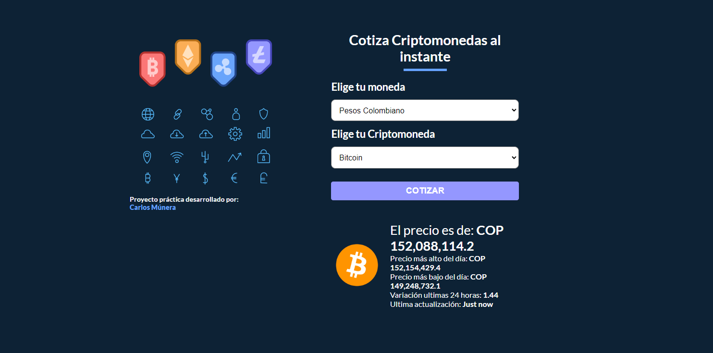

# Cotizador de Criptomonedas en  React.

## Descripción del proyecto
* Proyecto de práctica React - Vite: Cotiza criptomonedas al instante.
* [Ver Proyecto](https://github.com/CarlosMunera/criptos-react)

## Tecnologías Utilizada
* React - Vite
    * Hook useState
    * Hook UseEffect
    * Custom Hooks
    * Local Storage
* CSS
    * Styled components
    * Modulos CSS
* Google Fonts
* Fetch API - async / await
* Diseño web responsivo

## Herramientas - Utilidades
* Entorno de desarrollo Vite.
* Visual Studio Code
* API: CryptoCompare: https://www.cryptocompare.com/

## Autor
* [Alura](https://app.aluracursos.com/user/karlosmunera)
* [LinkedIn](https://www.linkedin.com/in/carlos-munera-259969262 "Linkedin")
* [Portafolio](https://carlosmunera.github.io/portafolio_RETO/)
